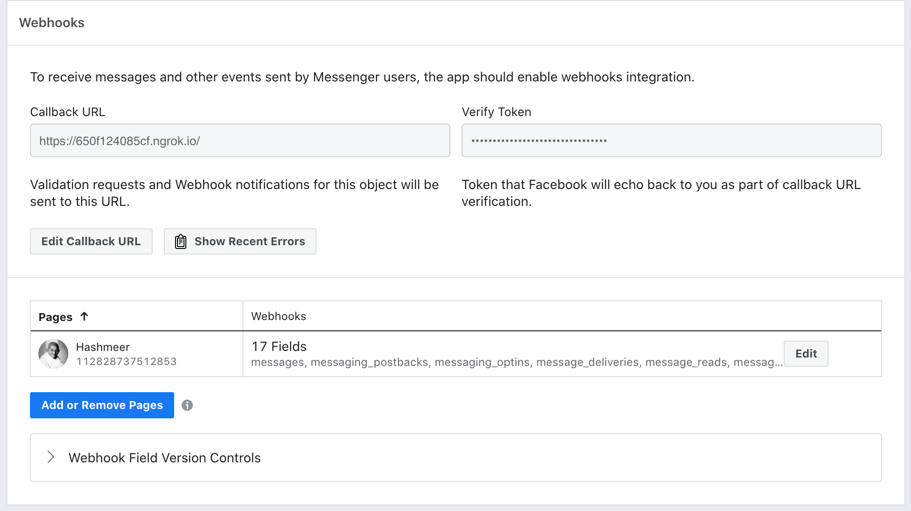
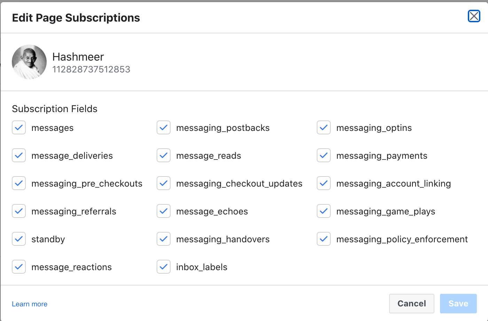

# Messenger Bot

Instructions

- Create App in FB developer
- Setup Project
- Setup WebHook

## Create App in FB Developer

Reference:
https://developers.facebook.com/docs/messenger-platform/getting-started/app-setup

### Create Page

https://www.facebook.com/pages/create

### Create App

https://developers.facebook.com/apps/


## Setup WebHook

Webhook verification
Run Flask app using ngrok
- `ngrok http 8080`
- run application in port 8080

Get your Ngrok Link then in callback url

Verify you webhook in your developer dashboard]


Add permisions in your chatbot


## Usage

Just run the script

```bash
./run.sh
```

This will start the Application in port 8080